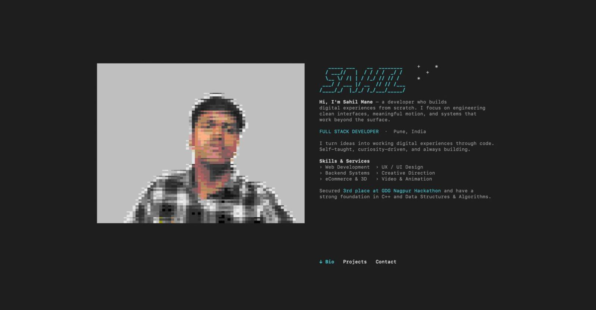

# sshportfolio

An interactive TUI portfolio, accessible from the terminal via SSH. Built with Node.js, `ssh2`, and `blessed`.



## Try it

```bash
ssh user@<your-ip> -p 3000
```

Navigate with `← →` arrow keys · Press `q` to quit

---

## Stack

- **[ssh2](https://github.com/mscdex/ssh2)** — SSH server
- **[blessed](https://github.com/chjj/blessed)** — Terminal UI framework
- **[chalk](https://github.com/chalk/chalk)** — Terminal colors
- **[figlet](https://github.com/patorjk/figlet.js)** — ASCII title art
- **[jimp](https://github.com/jimp-dev/jimp)** — Image to pixel art conversion

## Run Locally

```bash
git clone https://github.com/sahilmane69/sshportfolio.git
cd sshportfolio
npm install
node server.js
```

Then in a new terminal:
```bash
ssh user@localhost -p 3000
```

## Deploy (Azure / VPS)

```bash
git clone https://github.com/sahilmane69/sshportfolio.git portfolio
cd portfolio
npm install
npm install pm2 -g
pm2 start server.js --name tui-portfolio
pm2 save && pm2 startup
```

Open port `3000` in your firewall / cloud security group and share:
```bash
ssh user@your-server-ip -p 3000
```

---

Made by [Sahil Mane](https://sahilmane-one.vercel.app) · [LinkedIn](https://www.linkedin.com/in/sahilmane74/) · [GitHub](https://github.com/sahilmane69)
